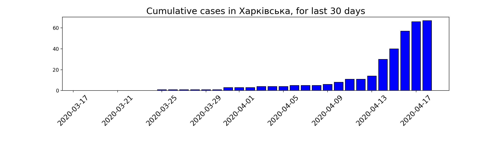
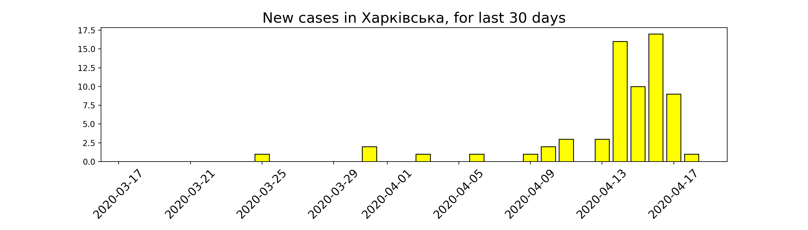
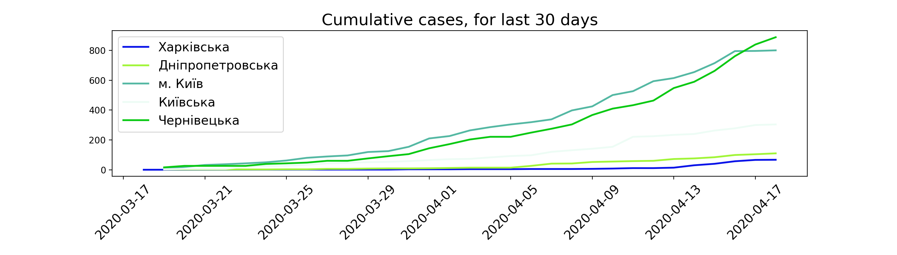

# Covid 19 Data analysis using example

https://towardsdatascience.com/analyze-ny-times-covid-19-dataset-86c802164210
https://github.com/tirthajyoti/Covid-19-analysis/blob/master/Notebook/NYTCovid.py
https://github.com/tirthajyoti/Covid-19-analysis/blob/master/Notebook/NYTCovid-test.ipynb

### Setup Locally

1. Install virtual env and activate, [link](https://gist.github.com/Geoyi/d9fab4f609e9f75941946be45000632b):

 `sudo pip3 install virtualenv  && virtualenv venv && source venv/bin/activate`

2. Install dependencies:

  `pip install -r requirements.txt`

3. Run it:

  `python NYTCovid_test.py`

### Dependencies

1. Pandas

https://www.datacamp.com/community/tutorials/pandas-tutorial-dataframe-python
https://www.shanelynn.ie/summarising-aggregation-and-grouping-data-in-python-pandas/

2. NumPy

3. Python Data structures

https://docs.python.org/3/tutorial/datastructures.html

### UA Covid

This is my implementation of the data analysis for Ukraine, data taken from https://github.com/VasiaPiven/covid19_ua.
The dashboard can be found on https://nszu.gov.ua/covid/dashboard.

### Results

